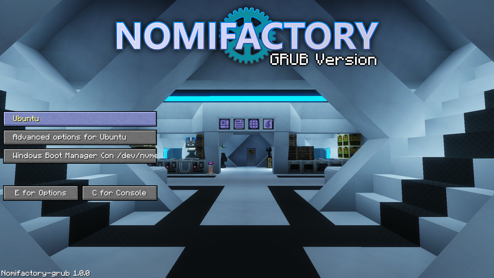

# Nomifactory GRUB theme

This is a fork of [minegrub-theme](https://github.com/Lxtharia/minegrub-theme) with a design based on [Nomifactory CEu](https://github.com/tracer4b/nomi-ceu) modpack menu.



## Installation

<!-- markdownlint-disable-next-line MD029 -->
0. Give yourself permission to access themes folder, if not yet:

    ```sh
    sudo chown $USER /boot/grub*/themes/
    ```

1. Clone the repository:

    ```sh
    cd /boot/grub*/themes/
    git clone https://github.com/ntdesmond/nomifactory-grub-theme
    ```

2. Edit GRUB config in `/etc/default/grub`, adding or changing this line:

    ```sh
    GRUB_THEME=/boot/grub/themes/minegrub-theme/theme.txt
    ```

    > Use `/boot/grub2/` above if your OS has it instead of `/boot/grub/`

3. Run `sudo update-grub` to upgrade your GRUB config.

4. You might need to edit [theme.txt](./theme.txt#L72) to adjust the height of the boot menu if you have more than 3 or 4 boot options.

    > Editing theme files does not require updating grub config.
    >
    > To preview theme changes without rebooting, you may use `grub-emu`.
    >
    > Caution: `grub-emu` reads keyboard when the terminal it was launched in is focused. To exit `grub-emu`, hit `C` and type `exit` in the GRUB command line.

5. (optional) Pick a background of your choice and replace `background.png` or enable switching backgrounds automatically after each system reboot. See README in [`./backgrounds`](./backgrounds) for more info.

## See also

- Original [minegrub-theme](https://github.com/Lxtharia/minegrub-theme)
- [Nomifactory CEu](https://github.com/tracer4b/nomi-ceu) and original [Nomifactory](https://github.com/Nomifactory/Nomifactory) Minecraft modpacks
- Minecraft font on [FontSpace](https://www.fontspace.com/minecraft-font-f28180)
